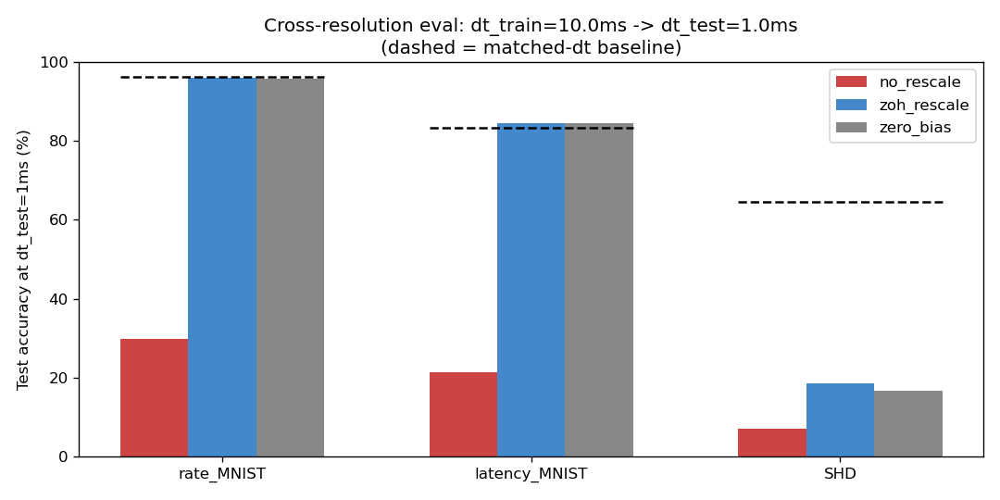

# snn_dt_diagnostic

Diagnostic tool for cross-resolution failure modes in surrogate-gradient trained spiking neural networks.

This is a runnable demo of a diagnostic that decomposes the accuracy drop you see when you take an SNN trained at one time-step and evaluate it at a finer one. It distinguishes the part of the failure that is closed-form rescuable (an analytical bias-rescaling fix derivable from impulse-invariant vs zero-order-hold discretisation) from the part that isn't (representation-level dependence on coincidence structure that doesn't survive finer binning).

Companion to a manuscript currently under review.

## What the demo shows

Three networks, each trained at dt_train = 10 ms, evaluated at dt_test = 1 ms on the same held-out test data binned at the finer resolution. For each dataset the demo runs three conditions at the finer dt:

- no_rescale — biases untouched. Shows the naive failure.
- zoh_rescale — biases multiplied by the closed-form ZOH factor rho = (1 - exp(-dt_test/tau_m)) / (1 - exp(-dt_train/tau_m)). Shows what the principled bias fix recovers.
- zero_bias — biases zeroed entirely. Reports the upper bound on what any bias correction can buy you.

Dashed line per dataset is the matched-dt baseline (the network evaluated at its training dt — the ceiling).

The failure decomposition output from one run:

        rate_MNIST: matched=96%  no_rescale=30%  zoh=96%  | bias_accum=100%  coincidence=0%
     latency_MNIST: matched=83%  no_rescale=21%  zoh=85%  | bias_accum=102%  coincidence=-2%
               SHD: matched=65%  no_rescale=7%   zoh=19%  | bias_accum=20%   coincidence=80%

Reading the rows:

On rate-coded MNIST (Poisson-encoded, zero-padded across resolutions) and latency-coded MNIST (Zenke & Vogels deterministic encoding), the cross-dt failure is entirely bias accumulation. ZOH rescaling fully recovers the matched-dt baseline. Zero-bias gives essentially the same number, confirming ZOH is hitting its ceiling.

On SHD (audio-driven cochlear-model spike data with strong cross-channel coincidence structure at coarse dt), only ~20% of the failure is bias accumulation; ~80% is coincidence-dependent representations that no parameter rescaling can recover.

This separates a closed-form fixable failure mechanism from a not-closed-form-fixable one, on the same task at the same dt ratio, just by varying which dataset the network was trained on.

## How to run it

Requires Python 3.10+. Install dependencies:

    pip install torch torchvision h5py matplotlib numpy

For SHD you'll also need the test HDF5 file from the Zenke lab. Download it once:

    mkdir -p ~/data/hdspikes
    curl -o ~/data/hdspikes/shd_test.h5.gz https://zenkelab.org/datasets/shd_test.h5.gz
    gunzip ~/data/hdspikes/shd_test.h5.gz

Then:

    python demo.py

Takes 5–10 minutes on a laptop (Apple MPS or CPU; CUDA works too if available). Produces the table above plus results.png.

## Repo structure

    snn_dt_diagnostic/
    ├── README.md
    ├── demo.py                # runnable entry point
    ├── checkpoints/           # pre-trained networks (small)
    │   ├── rate_mnist.pt
    │   ├── latency_mnist.pt
    │   └── shd.pt
    ├── dt_diagnose/           # the diagnostic module
    │   ├── __init__.py
    │   ├── network.py         # LIF neuron + feedforward SNN
    │   ├── encoders.py        # latency / rate-padded / SHD binning
    │   ├── rescaling.py       # closed-form ZOH bias rescaling
    │   └── eval.py            # three-condition eval + failure decomposition
    └── extract_checkpoints.py # one-off script to produce checkpoints/ from training outputs

## What this is and isn't

This is a demo, not a library. The eval logic is reusable (the dt_diagnose module exposes three_condition_eval, rho_bias_zoh, rescale_biases, etc.) but the framework adapters, input characterisation, recommendations engine, and proper packaging that would go into a v1 release are out of scope here. The point of this demo is to make the three-row table above reproducible in five minutes on a laptop, so that the underlying claim that cross-dt failure decomposes mechanistically and the components have different fixability profiles can be checked.

Specifically out of scope here:

- All three datasets are evaluated with input spike times held fixed across resolutions (zero-padded for rate-coded MNIST, deterministic by construction for latency MNIST, re-binning of the same physical events for SHD). Cross-dt failure modes that arise from input resampling, where the per-dt stochastic realisation changes, isn't probed by this demo.
- Per-term discretisation audit (the demo assumes a known SNN structure rather than inspecting an arbitrary user network).
- Multi-framework adapters (current code is for the demo's own Net class).
- Multiple seeds for error bars (the headline numbers above are from seed 6 only).

## Notes on metric choice

Accuracy is read from the time-averaged output membrane potential. The per-step cross-entropy loss used during training optimises membrane separation directly, and membrane readout gives an interpretable signal even when output spikes are sparse (as happens under cross-resolution evaluation). For matched-dt evaluation the two readouts give nearly identical accuracies; under cross-dt evaluation the spike-count readout collapses while membrane readout reveals the network's residual discriminative capacity behind the threshold.

## What the diagnostic is for

A user trains an SNN at some dt in a simulator. They want to deploy at a different dt, e.g. on neuromorphic hardware running at a fixed clock, or with different input sampling rates, or on a different software backend. They observe a performance drop. The diagnostic answers: which mechanism is dominant, and is it fixable?

If the drop is bias-accumulation-dominated, ZOH rescaling fixes it post-hoc with no retraining. If it's coincidence-loss-dominated, parameter rescaling won't help and the network needs to be retrained at the target dt or with coincidence-robust training. The diagnostic decomposes the gap and reports which.
